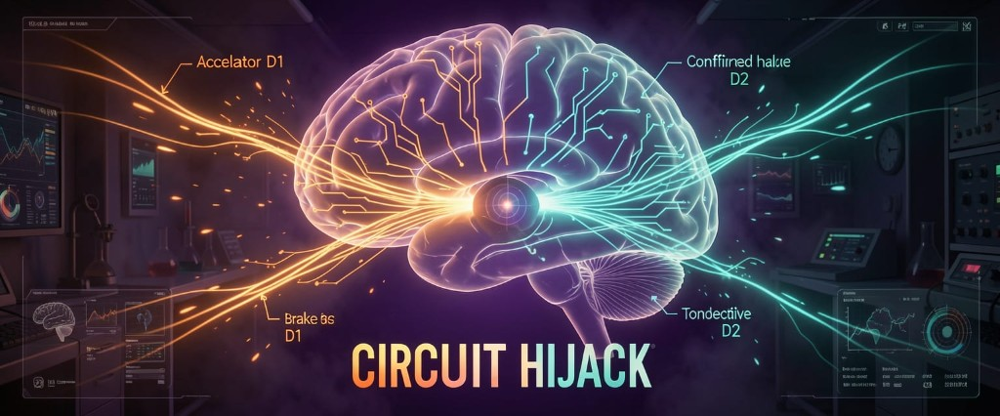

<p align="center">
  
</p>

<p align="center"><em>A pathology strategy experience built on Babylon.js — walk the reward circuit, feel the hijack, fight for regulation.</em></p>

<p align="center">

[](https://github.com/EricEisaman/babylon-game-starter/actions/workflows/typecheck.yml)
[](https://www.babylonjs.com)
[](https://www.typescriptlang.org)
[](LICENSE)

</p>

**Circuit Hijack** is an interactive 3D simulation of how chronic drug exposure can shift behavior from goal-directed choice toward compulsive habit. You explore a mesolimbic **Synaptic Lab**, where two forces compete in real time: the **D1 accelerator** (phasic dopamine, intense seeking) and the **D2 brake** (tonic regulation through OFC/ACC proxies). Conditioned cues fire reward-prediction error without delivering a drug. Your body signals **drug hunger** through the insula while the ACC decides whether that urge becomes conscious craving.

This is a **model-inspired educational game**, not medical advice or a diagnostic tool.

---

## Play in the browser

```sh
npm install
npm run dev
```

Open [http://localhost:3000](http://localhost:3000). The default world is **SynapticLab**; you play as **Tech Girl**.

### Controls

| Input | Action |
| ----- | ------ |
| **WASD** / arrows | Move |
| **Space** | Jump |
| **Shift** | Boost |
| **F** (hold) | Label urge — in the blue **ACC anchor** zone, strengthens insula–ACC coupling |
| **H** | Toggle HUD |

On mobile, use the on-screen joystick and buttons; hold **F** where supported or use a keyboard.

### What to do in the lab

- **Orange particle cues** — Conditioned stimuli. Approaching them triggers a **dopamine pulse** (RPE) even when no drug is present, pushing habit encoding upward.
- **Glowing crystals** — Drug proxies. Each use sensitizes D1, downregulates D2, and spikes habit encoding.
- **Green nebula (safe zone)** — Partial recovery of D2 and coupling; stay here to work toward a win.
- **Blue sparkles (ACC anchor)** — Hold **F** to raise ACC awareness and strengthen insula–ACC coupling, slowing hunger growth.

Watch the HUD bars: **D1 Accelerator**, **D2 Brake**, **Dopamine Pulse**, **Drug Hunger**, **Insula–ACC**, and **Habit Encoding**. A red vignette appears when hunger is high and conscious regulation is low.

### Win and lose

| Outcome | Condition |
| ------- | --------- |
| **Lose** | Habit encoding reaches compulsive dominance (~90%) |
| **Win** | In the safe zone, keep habit encoding low, coupling high, and regulate for ~10 seconds |

Try three paths: **abstain** (avoid drugs, feel cues and hunger), **binge** (collect both crystals), **regulate** (safe zone + ACC + **F**).

---

## The science (simplified)

The simulation follows a **Volkow-style** framing of addiction:

1. **Accelerator (D1)** — Low-affinity receptors driven by phasic dopamine; repeated drug use strengthens seeking.
2. **Brake (D2)** — High-affinity tonic receptors; chronic exposure downregulates D2, weakening orbitofrontal and anterior cingulate control.
3. **RPE pulse** — Unexpected reward (or cue-only prediction error) encodes habit faster.
4. **Interoceptive loop** — Insula hunger rises; ACC labeling (your **F** key in the anchor zone) modulates how urgently that hunger becomes conscious craving.

All tuning lives in config — no hard-coded magic numbers in gameplay code.

---

## Configuration (for designers and instructors)

| File | Purpose |
| ---- | ------- |
| [`src/client/config/neurochemistry_config.ts`](src/client/config/neurochemistry_config.ts) | D1/D2 curves, RPE, hunger, win/lose thresholds |
| [`src/client/config/assets.ts`](src/client/config/assets.ts) | **SynapticLab** environment: cues, drugs, zones, audio |
| [`src/client/config/game_config.ts`](src/client/config/game_config.ts) | HUD layout, Circuit Hijack boot flags |
| [`src/client/types/neurochemistry.ts`](src/client/types/neurochemistry.ts) | Type definitions for the simulation |

Other starter environments remain in `assets.ts` for development; append `?debug=` to the URL to expose them in Settings.

---

## Built on Babylon Game Starter

Circuit Hijack extends the **[Babylon Game Starter](BABYLON_GAME_STARTER.md)** framework: Havok physics, behavior triggers, collectibles, AudioV2, mobile controls, and playground export. For engine architecture, multiplayer, deployment, and contributor workflows, see:

- **[BABYLON_GAME_STARTER.md](BABYLON_GAME_STARTER.md)** — Original starter README (framework reference)
- **[USERS_GUIDE.md](USERS_GUIDE.md)** — Config and manager architecture
- **[MULTIPLAYER.md](MULTIPLAYER.md)** — Multiplayer (optional; not required for the core sim)

---

## Scripts

| Command | Description |
| ------- | ----------- |
| `npm run dev` | Run Circuit Hijack locally |
| `npm run build` | Production build to `dist/` |
| `npm run typecheck` | TypeScript check |
| `npm run lint` | ESLint |

Full script list: [BABYLON_GAME_STARTER.md#scripts](BABYLON_GAME_STARTER.md#scripts).

## Deploy to Netlify

This branch is configured for a **static Netlify** deploy at the site root (`basePath: /`). Multiplayer uses the shared starter Go server on Render — **`bgs-mp.onrender.com`** — with no `VITE_MULTIPLAYER_HOST` required.

1. Confirm [`src/deployment/settings/settings.mjs`](src/deployment/settings/settings.mjs) has `host: 'netlify'` (already set on this branch).
2. Run `npm run deploy:prepare` (regenerates [`netlify.toml`](netlify.toml)).
3. Connect the repo in Netlify; build command `npm ci && npm run build`, publish directory `dist` (also defined in `netlify.toml`).
4. Do **not** set `VITE_MULTIPLAYER_HOST` unless you are switching to a custom server.

Local dev still proxies `/api/multiplayer/*` → `localhost:5000` when you run `npm run dev:fullstack`. Details: [NETLIFY_STATIC_SITE_DEPLOYMENT.md](NETLIFY_STATIC_SITE_DEPLOYMENT.md).

---

## License

MIT — see [LICENSE](LICENSE).
